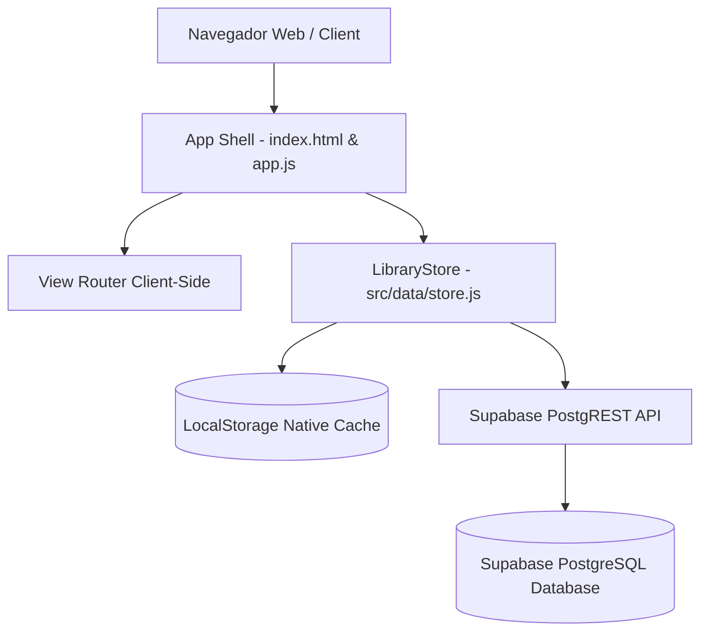

# 💻 Guia Técnico & Desenvolvedor - Biblioteca Camomila

Manual de arquitetura, desenvolvimento, base de dados e publicação em produção para a **Biblioteca Camomila**.

---

## 📌 Índice Técnico

1. [Arquitetura do Sistema](#-1-arquitetura-do-sistema)
2. [Estrutura de Ficheiros do Código-Fonte](#-2-estrutura-de-ficheiros-do-código-fonte)
3. [Camada de Dados & EventTarget Store](#-3-camada-de-dados--eventtarget-store)
4. [Esquema de Base de Dados Supabase (PostgreSQL)](#-4-esquema-de-base-de-dados-supabase-postgresql)
5. [Compilação & Testes Locais](#-5-compilação--testes-locais)
6. [Publicação em Produção (Deploy Gratuito)](#-6-publicação-em-produção-deploy-gratuito)

---

## 🏗️ 1. Arquitetura do Sistema

A aplicação foi desenvolvida seguindo os princípios de **Web Moderna Jamstack sem dependências pesadas de frameworks (Vanilla JavaScript ES Modules + HTML5 + CSS3 Glassmorphism)**:



### Principais Decisões de Engenharia:
- **Zero Heavy Framework Overhead**: Construído com JavaScript modular nativo, oferecendo carregamentos instantâneos e custos nulos de execução.
- **Single-Page Application (SPA)**: Navegação rápida sem recarregamento de página.
- **Resiliência Dual (Offline-First + Cloud Sync)**: O estado primário reside em `LocalStorage` com sincronização transparente REST via `fetch()` para a base de dados Supabase cloud.

---

## 📂 2. Estrutura de Ficheiros do Código-Fonte

```text
shared-library/
├── docs/
│   ├── README.md              # Portal principal de documentação
│   ├── USER_MANUAL.md         # Manual de utilização (Leitores & Bibliotecários)
│   └── DEVELOPER_GUIDE.md     # Este guia de arquitetura e desenvolvimento
├── public/
│   └── favicon.png            # Logótipo e favicon oficial da Biblioteca Camomila
├── src/
│   ├── components/            # Módulos de renderização UI
│   │   ├── auth.js            # Ecrã de login e registo de novos leitores
│   │   ├── catalog.js         # Vista de catálogo (Tabela, Grelha e Ordenação)
│   │   ├── dashboard.js       # Painel principal de métricas e KPIs
│   │   ├── loans.js           # Gestão de empréstimos, devoluções e prazos
│   │   ├── members.js         # Directório de leitores e aprovação de contas
│   │   ├── settings.js        # Definições cloud e cópias de segurança JSON
│   │   └── toast.js           # Notificações visuais flutuantes
│   ├── data/
│   │   ├── initialData.json   # Seed inicial exportado do Excel (20 livros, 3 empréstimos)
│   │   └── store.js           # Classe LibraryStore (EventTarget & CRUD)
│   ├── app.js                 # Ponto de entrada, autenticação e roteador de vistas
│   └── style.css              # Sistema de design CSS master e 5 temas visuais
├── dist/                      # Ficheiros estáticos minificados para produção (gerados via npm run build)
├── index.html                 # Estrutura base HTML5
├── package.json               # Dependências e scripts npm
├── supabase_schema.sql        # Script SQL para criação das tabelas e RLS no Supabase
└── vite.config.js             # Configurações do compilador Vite
```

---

## ⚡ 3. Camada de Dados & EventTarget Store

O ficheiro [`src/data/store.js`](file:///c:/TFS/zDomo/shared-library/src/data/store.js) implementa a classe `LibraryStore` estendendo `EventTarget`:

```javascript
class LibraryStore extends EventTarget {
  // Notifica componentes quando os dados são alterados
  notifyChange() {
    this.dispatchEvent(new CustomEvent('store-change'));
  }
}
```

### Principais Chaves de Armazenamento (`LocalStorage`):
- `shared_library_books`: Coleção de livros no catálogo.
- `shared_library_members`: Directório de leitores e bibliotecários.
- `shared_library_loans`: Histórico de empréstimos e devoluções.
- `shared_library_user`: Sessão ativa autenticada.
- `shared_library_cloud_config`: URL e Anon Key do Supabase.

---

## 🌩️ 4. Esquema de Base de Dados Supabase (PostgreSQL)

Execute o ficheiro [`supabase_schema.sql`](file:///c:/TFS/zDomo/shared-library/supabase_schema.sql) no SQL Editor do Supabase para criar as 3 tabelas ativas:

```sql
-- 1. Tabela de Livros
CREATE TABLE IF NOT EXISTS public.books (
    id TEXT PRIMARY KEY,
    title TEXT NOT NULL,
    author TEXT NOT NULL,
    genre TEXT NOT NULL,
    pub_year INTEGER,
    status TEXT NOT NULL DEFAULT 'Disponível',
    cover_url TEXT,
    isbn TEXT,
    publisher TEXT,
    synopsis TEXT,
    shelf_location TEXT,
    created_at TIMESTAMP WITH TIME ZONE DEFAULT CURRENT_TIMESTAMP
);

-- 2. Tabela de Leitores / Membros
CREATE TABLE IF NOT EXISTS public.members (
    id TEXT PRIMARY KEY,
    full_name TEXT NOT NULL,
    email TEXT NOT NULL UNIQUE,
    phone TEXT,
    joined_date DATE DEFAULT CURRENT_DATE,
    role TEXT DEFAULT 'patron',
    created_at TIMESTAMP WITH TIME ZONE DEFAULT CURRENT_TIMESTAMP
);

-- 3. Tabela de Empréstimos
CREATE TABLE IF NOT EXISTS public.loans (
    id TEXT PRIMARY KEY,
    book_id TEXT REFERENCES public.books(id) ON DELETE CASCADE,
    member_name TEXT NOT NULL,
    member_email TEXT,
    checkout_date DATE NOT NULL,
    due_date DATE NOT NULL,
    status TEXT NOT NULL DEFAULT 'Emprestado',
    return_date DATE,
    notes TEXT,
    created_at TIMESTAMP WITH TIME ZONE DEFAULT CURRENT_TIMESTAMP
);

-- Políticas de Acesso Row Level Security (RLS)
ALTER TABLE public.books ENABLE ROW LEVEL SECURITY;
ALTER TABLE public.members ENABLE ROW LEVEL SECURITY;
ALTER TABLE public.loans ENABLE ROW LEVEL SECURITY;

CREATE POLICY "Allow public read-write for books" ON public.books FOR ALL USING (true) WITH CHECK (true);
CREATE POLICY "Allow public read-write for members" ON public.members FOR ALL USING (true) WITH CHECK (true);
CREATE POLICY "Allow public read-write for loans" ON public.loans FOR ALL USING (true) WITH CHECK (true);
```

---

## 🛠️ 5. Compilação & Testes Locais

### Iniciar Servidor Dev:
```bash
npm run dev
```

### Compilar Pacote de Produção:
```bash
npm run build
```

### Testar Build de Produção Localmente:
```bash
npm run preview
```

---

## 🚀 6. Publicação em Produção (Deploy Gratuito)

### 🐙 Publicação no GitHub Pages (Recomendado)
1. Crie um repositório no GitHub e envie o código (`git push`).
2. Aceda a **Settings -> Pages**.
3. Em **Build and Deployment**, defina a fonte para **GitHub Actions**.

### ⚡ Publicação no Vercel (1-Clique)
```bash
npx vercel
```

### 📦 Publicação no Netlify (Drag & Drop)
1. Execute `npm run build`.
2. Arraste a pasta `dist` gerada para o painel de sites do [Netlify.com](https://netlify.com).
