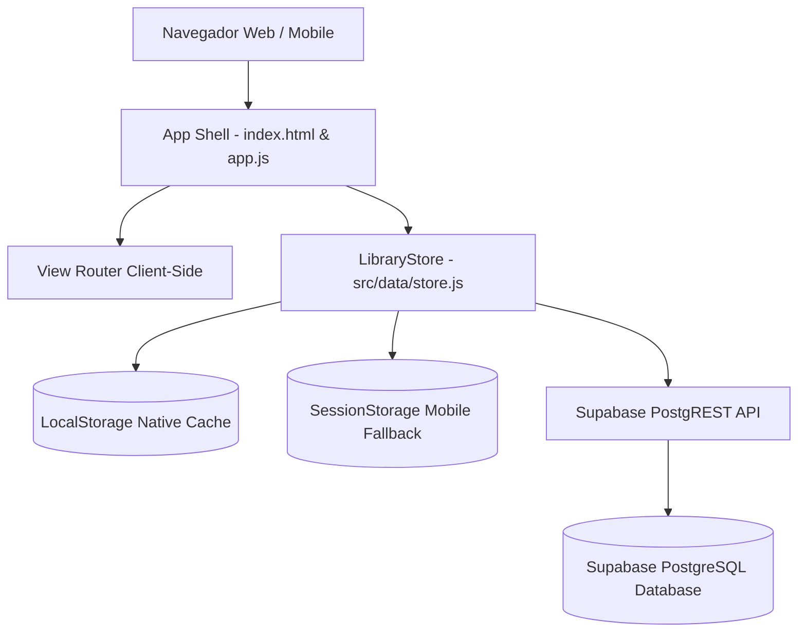

# 💻 Guia Técnico & Arquitetura - Biblioteca Camomila

Guia de engenharia de software, arquitetura, esquema de base de dados e infraestrutura para a **Biblioteca Camomila**.

---

## 📌 Índice Técnico

1. [🏗️ 1. Arquitetura do Sistema & Decisões de Engenharia](#1-arquitetura-do-sistema--decisões-de-engenharia)
2. [📂 2. Estrutura de Ficheiros do Código-Fonte](#2-estrutura-de-ficheiros-do-código-fonte)
3. [⚡ 3. Gestão de Estado & EventTarget Store](#3-gestão-de-estado--eventtarget-store)
4. [🌩️ 4. Base de Dados Cloud Supabase (PostgreSQL & RLS)](#4-base-de-dados-cloud-supabase-postgresql--rls)
5. [🔐 5. Variáveis de Ambiente & Segurança](#5-variáveis-de-ambiente--segurança)
6. [🛠️ 6. Compilação, Testes & Deploy (Vercel & GitHub Pages)](#6-compilação-testes--deploy-vercel--github-pages)

---

## 🏗️ 1. Arquitetura do Sistema & Decisões de Engenharia

A aplicação foi construída seguindo os princípios da web moderna **Jamstack (Vanilla JavaScript ES Modules + HTML5 + CSS3 Custom Properties & Glassmorphism)**:



### Principais Decisões de Engenharia:
- **Zero Heavy Framework Overhead**: Construído sem dependências de React, Angular ou Vue, proporcionando carregamentos sub-segundo (<500ms) e consumo mínimo de memória.
- **Single-Page Application (SPA)**: Roteamento client-side em `src/app.js` permitindo transições instantâneas entre módulos.
- **Resiliência Dual (Offline-First + Cloud Sync)**: Armazenamento local primário em `LocalStorage` com sincronização bidirecional REST via `fetch()` para o Supabase.
- **Mobile First & Touch Optimized**: Suporte nativo a gestos de toque, barra de navegação inferior mobile e sanitização de teclados de telemóvel (iOS Safari & Android Chrome).

---

## 📂 2. Estrutura de Ficheiros do Código-Fonte

```text
shared-library/
├── docs/
│   ├── USER_MANUAL.md         # Manual de utilização por módulos (Leitores & Bibliotecários)
│   └── DEVELOPER_GUIDE.md     # Este guia de arquitetura e desenvolvimento
├── public/
│   └── favicon.png            # Logótipo e favicon oficial da Biblioteca Camomila
├── src/
│   ├── components/            # Módulos UI reativos
│   │   ├── auth.js            # Autenticação, formulários e banners de erro
│   │   ├── catalog.js         # Vista de catálogo (Tabela, Grelha, APIs externas e Ordenação)
│   │   ├── dashboard.js       # Painel de controlo, KPIs e distribuição por género
│   │   ├── loans.js           # Gestão de requisições, devoluções e prazos
│   │   ├── members.js         # Directório de leitores, aprovações e reset de password
│   │   ├── settings.js        # Definições, temas, backups JSON e audit log de popups
│   │   └── toast.js           # Notificações visuais flutuantes e registo de eventos
│   ├── data/
│   │   ├── initialData.json   # Seed de dados iniciais extraídos do Excel
│   │   └── store.js           # EventTarget Store, métodos CRUD e sincronização
│   ├── app.js                 # Ponto de entrada, roteador SPA e gestão de acessos
│   └── style.css              # Design system CSS master, responsive design e 5 temas
├── dist/                      # Ficheiros estáticos minificados para produção (gerados via npm run build)
├── index.html                 # Estrutura base HTML5 da aplicação
├── package.json               # Dependências e scripts Vite
├── README.md                  # Apresentação comercial/funcional para clientes
├── supabase_schema.sql        # Script DDL SQL para criação de tabelas e RLS no Supabase
└── vite.config.js             # Configurações do compilador Vite
```

---

## ⚡ 3. Gestão de Estado & EventTarget Store

O ficheiro [`src/data/store.js`](file:///c:/TFS/zDomo/shared-library/src/data/store.js) implementa a classe reativa `LibraryStore` estendendo a API nativa `EventTarget`:

```javascript
class LibraryStore extends EventTarget {
  notifyChange() {
    this.dispatchEvent(new CustomEvent('store-change'));
  }
}
```

### Chaves de Armazenamento (`LocalStorage` & `SessionStorage`):
- `shared_library_books`: Coleção de livros do catálogo.
- `shared_library_members`: Directório de leitores e bibliotecários.
- `shared_library_loans`: Requisições e empréstimos ativos e históricos.
- `shared_library_current_user`: Sessão ativa autenticada.
- `shared_library_cloud_config`: Credenciais ativas do Supabase.
- `shared_library_toast_logs`: Histórico auditável de notificações popups.

---

## 🌩️ 4. Base de Dados Cloud Supabase (PostgreSQL & RLS)

Execute o ficheiro [`supabase_schema.sql`](file:///c:/TFS/zDomo/shared-library/supabase_schema.sql) no Editor SQL do Supabase para criar as tabelas com políticas de segurança:

```sql
-- 1. Tabela de Livros
CREATE TABLE IF NOT EXISTS public.books (
    id TEXT PRIMARY KEY,
    title TEXT NOT NULL,
    author TEXT NOT NULL,
    genre TEXT NOT NULL,
    pub_year INTEGER,
    status TEXT NOT NULL DEFAULT 'Disponível',
    cover_url TEXT,
    isbn TEXT,
    publisher TEXT,
    synopsis TEXT,
    shelf_location TEXT,
    created_at TIMESTAMP WITH TIME ZONE DEFAULT CURRENT_TIMESTAMP
);

-- 2. Tabela de Leitores / Membros
CREATE TABLE IF NOT EXISTS public.members (
    id TEXT PRIMARY KEY,
    full_name TEXT NOT NULL,
    email TEXT NOT NULL UNIQUE,
    phone TEXT,
    joined_date DATE DEFAULT CURRENT_DATE,
    role TEXT DEFAULT 'patron',
    password TEXT DEFAULT '123456',
    created_at TIMESTAMP WITH TIME ZONE DEFAULT CURRENT_TIMESTAMP
);

-- 3. Tabela de Empréstimos
CREATE TABLE IF NOT EXISTS public.loans (
    id TEXT PRIMARY KEY,
    book_id TEXT REFERENCES public.books(id) ON DELETE CASCADE,
    member_name TEXT NOT NULL,
    member_email TEXT,
    checkout_date DATE NOT NULL,
    due_date DATE NOT NULL,
    status TEXT NOT NULL DEFAULT 'Emprestado',
    return_date DATE,
    notes TEXT,
    created_at TIMESTAMP WITH TIME ZONE DEFAULT CURRENT_TIMESTAMP
);

-- Políticas de Acesso Row Level Security (RLS)
ALTER TABLE public.books ENABLE ROW LEVEL SECURITY;
ALTER TABLE public.members ENABLE ROW LEVEL SECURITY;
ALTER TABLE public.loans ENABLE ROW LEVEL SECURITY;

CREATE POLICY "Allow public read-write for books" ON public.books FOR ALL USING (true) WITH CHECK (true);
CREATE POLICY "Allow public read-write for members" ON public.members FOR ALL USING (true) WITH CHECK (true);
CREATE POLICY "Allow public read-write for loans" ON public.loans FOR ALL USING (true) WITH CHECK (true);
```

---

## 🔐 5. Variáveis de Ambiente & Segurança

O sistema suporta injeção de variáveis de ambiente compiladas via Vite:

- **`VITE_SUPABASE_URL`**: URL do projeto Supabase (`https://<seu-projeto>.supabase.co`).
- **`VITE_SUPABASE_ANON_KEY`**: Chave pública anónima do Supabase.

No Vercel, configure estas variáveis em **Project Settings > Environment Variables**. A compilação Vite injeta-as automaticamente no pacote de produção.

> [!TIP]
> A chave `VITE_SUPABASE_ANON_KEY` é segura para utilização no browser, pois a segurança dos dados é garantida pelas políticas RLS da base de dados PostgreSQL.

---

## 🛠️ 6. Compilação, Testes & Deploy (Vercel & GitHub Pages)

### Comandos de Desenvolvimento
```bash
# Iniciar servidor de desenvolvimento com Hot Module Reloading (HMR)
npm run dev

# Compilar pacote otimizado para produção (gerado na pasta dist/)
npm run build

# Testar o pacote de produção localmente
npm run preview
```

### Deploy no Vercel (Recomendado)
A aplicação está configurada para deploy automático no Vercel através de ligação ao repositório GitHub. Qualquer `push` no ramo `main` desencadeia um novo build em segundos.

---

<div align="center">
  <p>Desenvolvido para a <b>Biblioteca Camomila</b> . Todos os direitos reservados.</p>
</div>
